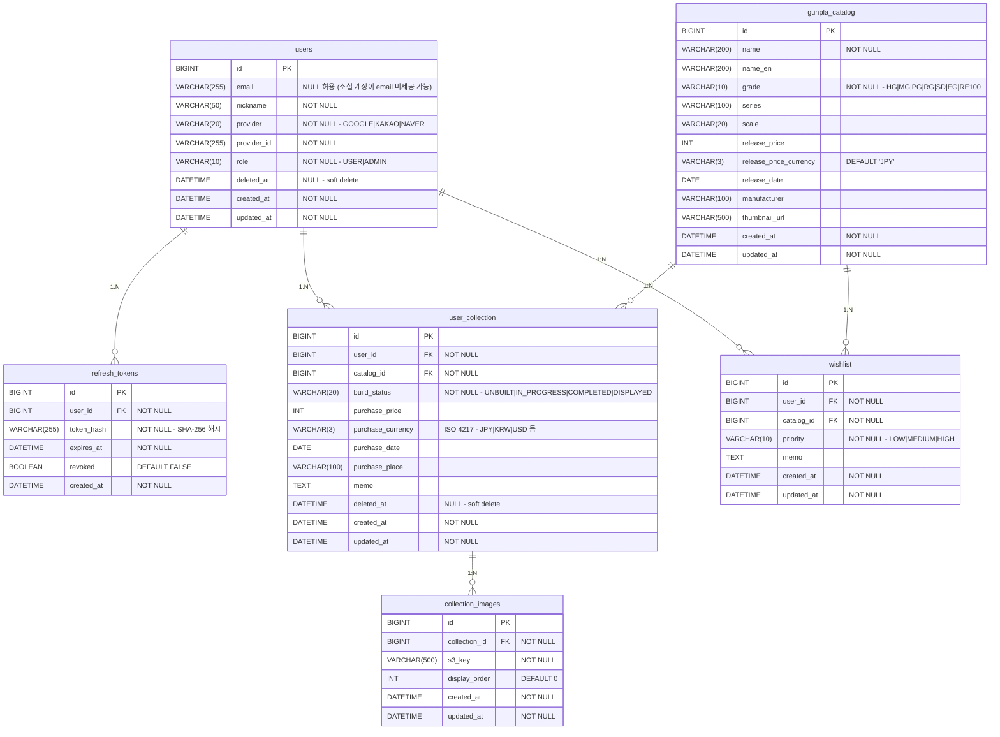

# ERD (Entity Relationship Diagram)

## 제약 조건

| 테이블 | 제약 | 설명 |
|--------|------|------|
| `users` | `UNIQUE(provider, provider_id)` | 소셜 계정 중복 방지 (email UK 제거) |
| `users` | `INDEX(email)` | 조회용 인덱스 (UK 아님) |
| `refresh_tokens` | `INDEX(user_id)`, `INDEX(expires_at)` | 조회 및 만료 토큰 정리 성능 |
| `refresh_tokens` → `users` | `ON DELETE CASCADE` | 회원 탈퇴 시 토큰 삭제 |
| `user_collection` | `INDEX(user_id)`, `INDEX(build_status)` | 조회 성능 |
| `user_collection` | `INDEX(user_id, deleted_at)` | Soft delete 필터 성능 |
| `gunpla_catalog` | `INDEX(grade)`, `INDEX(series)` | 필터 성능 |
| `wishlist` | `UNIQUE(user_id, catalog_id)` | 같은 카탈로그 중복 위시 방지 |
| `user_collection` → `users` | `ON DELETE CASCADE` | 회원 탈퇴 시 컬렉션 연쇄 삭제 |
| `collection_images` → `user_collection` | `ON DELETE CASCADE` | 컬렉션 삭제 시 이미지 연쇄 삭제 |
| `wishlist` → `users` | `ON DELETE CASCADE` | 회원 탈퇴 시 위시리스트 연쇄 삭제 |

## 설계 결정사항

### 1. email UK 제거 (소셜 로그인 전략)
- **정책**: 같은 이메일이라도 `(provider, provider_id)` 조합이 다르면 **별도 유저로 취급**
- **이유**: 같은 이메일로 Google, Kakao 각각 가입 시 UK 충돌 회피
- **트레이드오프**: 계정 통합 기능 부재 (Phase 2에서 고려)
- email에는 UK 대신 일반 인덱스만 부여하여 관리자 조회 성능 확보

### 2. Soft Delete (`deleted_at`)
- `users`, `user_collection`은 `deleted_at` 컬럼으로 soft delete
- 실수 복구 경로 확보 및 감사 추적 용이
- JPA에서는 `@SQLDelete`, `@Where` 또는 Hibernate 6의 `@SoftDelete` 사용
- `collection_images`, `wishlist`는 hard delete (연쇄 삭제로 충분)

### 3. Refresh Token 저장
- **평문 저장 금지**: `token_hash` 컬럼에 SHA-256 해시로 저장
- DB 유출 시 토큰 탈취를 방지하기 위한 설계
- `revoked` 플래그로 로그아웃 시 무효화 (hard delete 대신 추적 가능)
- 만료 토큰 정리는 배치 스케줄러로 처리 (`@Scheduled`)

### 4. 통화 필드 추가 (`purchase_currency`, `release_price_currency`)
- 건프라 구매 특성상 여러 국가 통화가 혼재 (JPY 직구, KRW 국내, USD 아마존)
- ISO 4217 3자리 코드 사용 (`JPY`, `KRW`, `USD`, `EUR` 등)
- `gunpla_catalog.release_price`는 반다이 정가 기준이므로 기본값 `JPY`

### 5. ENUM 대신 VARCHAR
- Hibernate 6 `ddl-auto=validate` 가 MySQL ENUM 타입을 VARCHAR로 인식하지 못하는 문제 방지
- 애플리케이션 레이어에서 enum 매핑 (`@Enumerated(EnumType.STRING)`)

### 6. 중복 보유 허용
- `user_collection`은 같은 `(user_id, catalog_id)` 조합 여러 행 가능
- 예: 동일 모델 2개 구매 (전시용 + 조립용 분리)

### 7. `DATETIME(6)` 정밀도
- Hibernate 6 + MySQL 조합에서 `LocalDateTime` 매핑 시 마이크로초 정밀도 사용
- Flyway 마이그레이션에서 명시적으로 `DATETIME(6)` 지정
