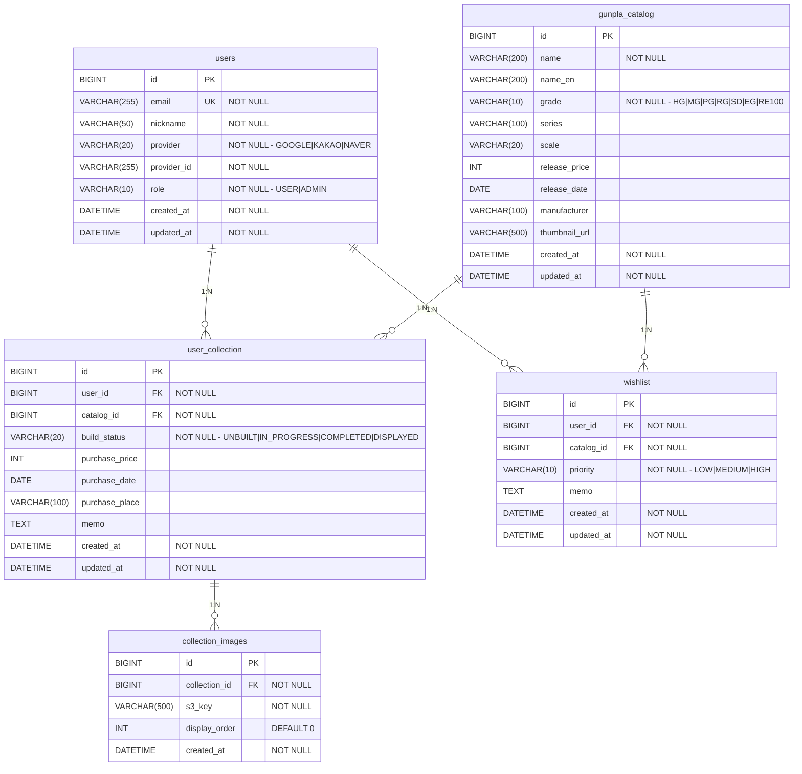

# ERD (Entity Relationship Diagram)

## 제약 조건

| 테이블 | 제약 | 설명 |
|--------|------|------|
| `users` | `UNIQUE(provider, provider_id)` | 소셜 계정 중복 방지 |
| `user_collection` | `INDEX(user_id)`, `INDEX(build_status)` | 조회 성능 |
| `gunpla_catalog` | `INDEX(grade)`, `INDEX(series)` | 필터 성능 |
| `wishlist` | `UNIQUE(user_id, catalog_id)` | 같은 카탈로그 중복 위시 방지 |
| `user_collection` → `users` | `ON DELETE CASCADE` | 회원 탈퇴 시 컬렉션 자동 삭제 |
| `collection_images` → `user_collection` | `ON DELETE CASCADE` | 컬렉션 삭제 시 이미지 자동 삭제 |

## 설계 결정사항

- **ENUM → VARCHAR**: Hibernate 6 `ddl-auto=validate` 가 MySQL ENUM 타입을 VARCHAR로 인식하지 못하는 문제 방지
- **중복 보유 허용**: `user_collection`은 같은 `(user_id, catalog_id)` 조합 여러 행 가능 (동일 모델 2개 구매 등)
- **`DATETIME(6)`**: Hibernate 6 + MySQL 조합에서 `LocalDateTime` 매핑 시 마이크로초 정밀도 사용
